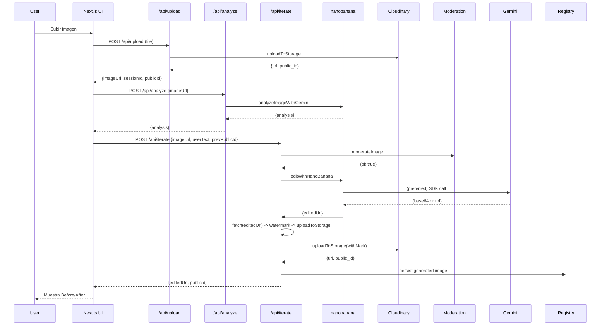
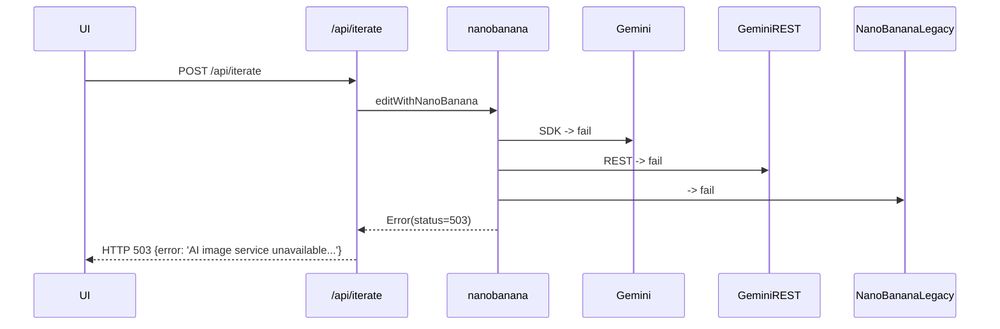

# Diagramas y flujos (Mermaid)

Los diagramas están en formato Mermaid para que puedas pegarlos en Markdown renderers compatibles o en VS Code con la extensión Mermaid Preview.

## 1) Diagrama de componentes

```mermaid
flowchart TD
  WebUI[(Next.js Web UI)] -->|POST /api/upload| UploadAPI[Upload Route]
  WebUI -->|POST /api/analyze| AnalyzeAPI[Analyze Route]
  WebUI -->|POST /api/iterate| IterateAPI[Iterate Route]

  UploadAPI --> Storage[Cloudinary / local uploads]
  AnalyzeAPI --> Gemini[Gemini SDK / Vision API]
  IterateAPI --> Moderation[Image Moderation]
  IterateAPI --> Nanobanana[AI Orchestrator (nanobanana)]
  Nanobanana --> Gemini
  Nanobanana --> GeminiREST[Gemini REST Proxy]
  Nanobanana --> NanoBananaLegacy[Legacy NanoBanana Service]
  IterateAPI --> Storage
  IterateAPI --> Registry[data/generated_images.json]
  IterateAPI --> Logs[logs/ai_calls.log]
```

## 2) Secuencia: upload -> analyze -> iterate (happy path)



## 3) Error path: no remote editors




---

Pega estos diagramas en un visor Mermaid o en GitHub (si soporta mermaid) para visualizarlos.
